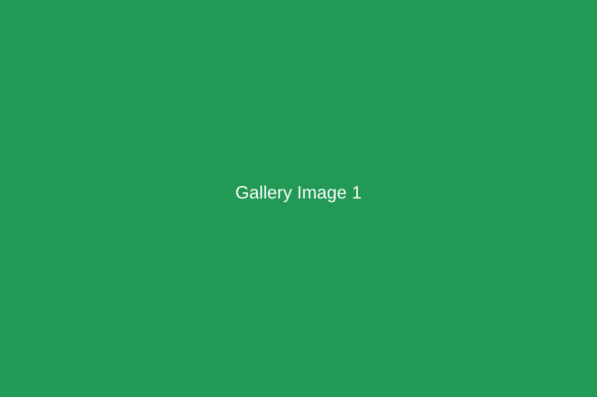

# Reședință Privată în Cadru Natural

Această vilă contemporană se află pe un teren în pantă cu vedere spre Sibiu, concepută ca o reședință privată care echilibrează confortul modern cu respectul pentru peisajul natural. Casa de 350 de metri pătrați creează conexiuni intime între spațiile interioare de locuit și mediul înconjurător.

## Teren și Context

Terenul în pantă a prezentat atât provocări, cât și oportunități. În loc să niveleze terenul, designul lucrează cu topografia naturală, minimizând perturbarea site-ului și creând multiple niveluri care urmează contururile dealului. Această abordare reduce impactul construcției, oferind în același timp perspective variate asupra văii de dedesubt.

Prioritățile de design au inclus:

- Păstrarea copacilor existenți și a vegetației naturale
- Maximizarea vederilor menținând în același timp intimitatea
- Crearea de conexiuni fluide interior-exterior
- Utilizarea materialelor și metodelor de construcție durabile
- Integrarea armonioasă a clădirii în peisaj

## Concept Arhitectural

Forma vilei răspunde condițiilor site-ului și nevoilor programatice. Un plan liniar urmează conturul dealului, cu spații de locuit orientate pentru a capta lumina sudică și vederile asupra văii. Panouri mari de sticlă glisante dizolvă granițele dintre interior și exterior, extinzând zonele de locuit pe terase care servesc ca camere în aer liber.

Paleta de materiale pune accent pe texturi naturale—piatră de proveniență locală, îmbrăcăminte din lemn natural și suprafețe din tencuială netedă creează o estetică reținută care complementează peisajul. Un acoperiș verde pe nivelul inferior integrează structura în deal atunci când este privită de sus.

## Spații Interioare

Layout-urile interioare pun accent pe continuitatea spațială și lumina naturală. Nivelul de intrare conține zone de living, dining și bucătărie configurate ca un spațiu deschis fluid. Geamul pe toată înălțimea oferă conexiune vizuală constantă cu peisajul. Un spațiu cu dublă înălțime la zona de living creează volum dramatic, facilitând în același timp ventilația naturală.

Nivelul inferior include trei dormitoare, fiecare cu acces direct la zone de terasă private. Suite-ul principal se deschide spre o grădină retrasă sculptată în deal. Un birou la domiciliu ocupă un colț liniștit cu vederi prin coronamentul copacilor.

## Caracteristici Durabile

Performanța ecologică a fost integrală în design:

- Anvelopă de înaltă performanță minimizează încărcările de încălzire și răcire
- Pompă de căldură geotermală oferă control eficient al climatului
- Panouri solare integrate în structura acoperișului
- Strategii de ventilație naturală reduc nevoile de răcire mecanică
- Colectarea apei de ploaie pentru irigarea peisajului
- Plantații native necesită apă și întreținere minimă

## Materiale și Detalii

Selecția materialelor a prioritizat durabilitatea, întreținerea redusă și responsabilitatea ecologică. Pardoselile interioare folosesc gresie de format mare și stejar natural. Mobilierul integrat maximizează eficiența spațiului, reducând în același timp utilizarea materialelor. Dotările bucătăriei și băii echilibrează calitatea estetică cu conservarea apei.

## Viață în Aer Liber

Designul peisajului extinde conceptul arhitectural. Multiple niveluri de terase creează camere distincte în aer liber—de la terasa principală de divertisment lângă zona de living, la zone intime de relaxare integrate în grădină. Plantațiile indigene atrag fauna locală, necesitând în același timp irigare minimă.

## Finalizare Proiect

Construcția a fost finalizată în septembrie 2023. Vila demonstrează că arhitectura rezidențială contemporană poate atinge performanță ridicată și confort modern, respectând în același timp cadrele naturale și minimizând impactul asupra mediului. Proprietarii raportează satisfacție ridicată cu calitatea spațiilor de locuit și performanța energetică a clădirii.

Acest proiect ilustrează convingerea noastră că designul rezidențial gândit creează case care îmbunătățesc viața zilnică, lăsând în același timp o amprentă ușoară pe peisaj.
